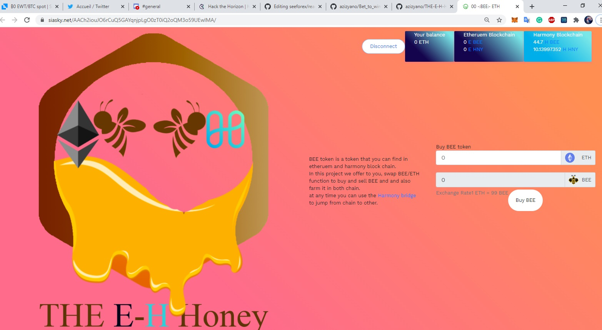

# THE-E-H-Honey

Harmony Hackathon:

buy BEE  TOKEN  and stake it in any chain you want Etheruem or harmony 
the reward will be the HNY TOKEN 
uses Harmony's bridge ETH<->ONE to jump from chain to another.

## How to use it
install Harmony One Wallet extension for Brave, Chrome and Firefox.
get some test token using this link
https://faucet.pops.one/

https://onefaucet.ibriz.ai/

buy BEE token and stake it in harmony chain or use the bridge to jump to etheruem network. all contract was deployed in kovan network.
as a reward for staking you will earn HNY token 

## demo:
skynet 
https://siasky.net/AACh2iouJO6rCuQ5GAYqnjpLgO0zT0iQ2oQM3o59UEwlMA/

youtube

this project was a submission for the harmony hackathon https://gitcoin.co/issue/harmony-one/hackathon/1/100024063
team https://gitcoin.co/arabya and https://gitcoin.co/azizyano
